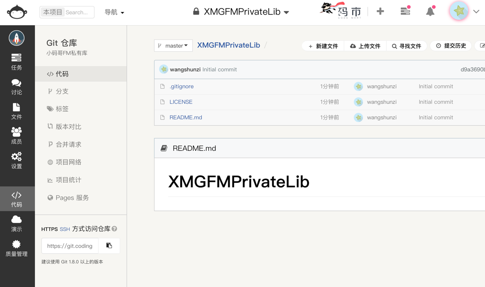

## CocoaPods 远程私有库的使用

### 私有 Spec Repo 创建
	
* 第一步



* 第二步


* 第三步


	
### 创建 Pod 的所需要的项目工程文件，并上传到私有仓库

* 创建仓库工程模板
	
	```bash
	pod lib create XXXLib
	```
	
* 添加需要的库文件到相应文件夹
* 测试无误后, 提交代码到远程私有仓库
	
	```bash
	# 关联远程库
	git remote add origin 远程仓库地址
	# 提交到远程仓库
	git push origin master
	```

* 打标签, 并提交到远程仓库
			
	```bash
	git tag -m "初始版本" "0.1.0"
	# 推送tag到远端仓库
	git push --tags    
	```
		
### 创建 Pod 所对应的 podspec 文件, 并进行验证/测试

* 如果只需要创建 podspec 文件, 可以使用如下命令
	
	```bash
	pod spec create XXX
	```
		
* 验证 podspec 文件
	
	```bash
	pod lib lint
	```
	
* 本地测试 podspec 文件
	* 创建 Podfile 文件
		
		```
		# 指定podspec文件
		pod 'XXX', :podspec => 'path/XXX.podspec'
		```
	
	* 执行 `pod install`

### 向私有的Spec Repo中提交podspec

```bash
pod repo push SpecName XXX.podspec
```

### 使用pod库

```bash
pod search XXXLib
```

### 更新维护 podspec

* 如果想在pod仓库中添加子仓库，使用 subspec

	```ruby
	s.subspec 'XXXSub' do |sb|
		sb.source_files = '相对路径/**/*'
		sb.public_header_files = '相对路径/**/*.h'
		sb.resource = "相对路径/**/*.{bundle,nib,xib}"
		sb.dependency 'xxx', '~> 1.0.0'
	end
	```

* **注意: 不要在头文件导入依赖其他库的头文件**
* 测试

	```
	# 私有的远程仓库地址
	source 'git@git.coding.net:wangshunzi/XMGFMSpecs.git'
	# 官方仓库的地址
	source 'https://github.com/CocoaPods/Specs.git'  
	pod 'XXXLib/XXXSub'
	```

### 队友如何使用?

* 添加本地私有库(需要你分配权限给他)
* 直接配置 Podfile 文件，别忘了添加以下两行命令，缺一不可

	```
	# 私有索引库
	source 'git@git.coding.net:wangshunzi/XMGFMSpecs.git'
	# 官方仓库的地址
	source 'https://github.com/CocoaPods/Specs.git'  
	```