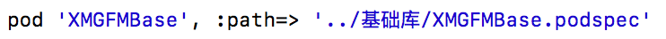
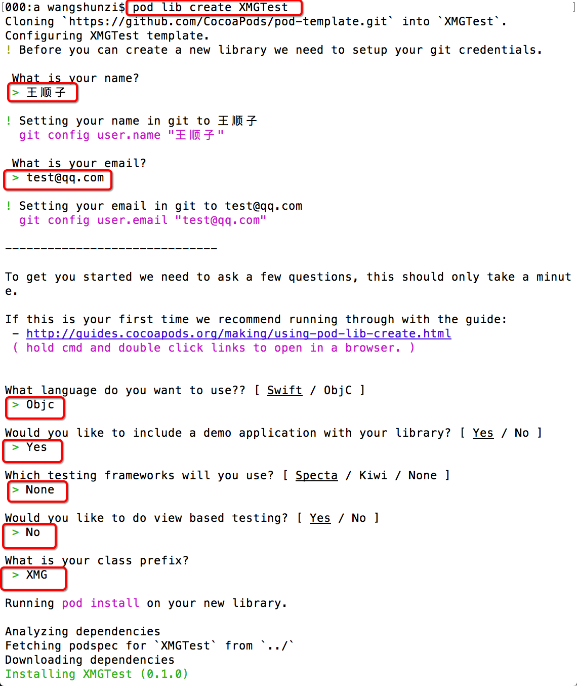
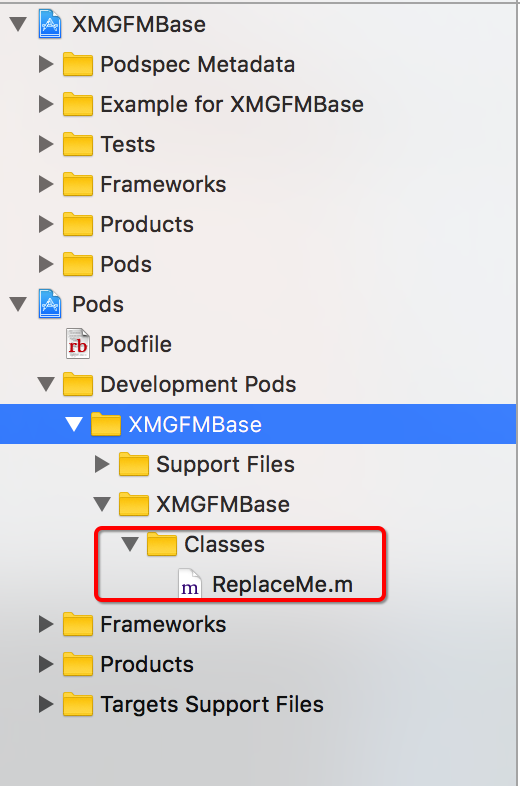
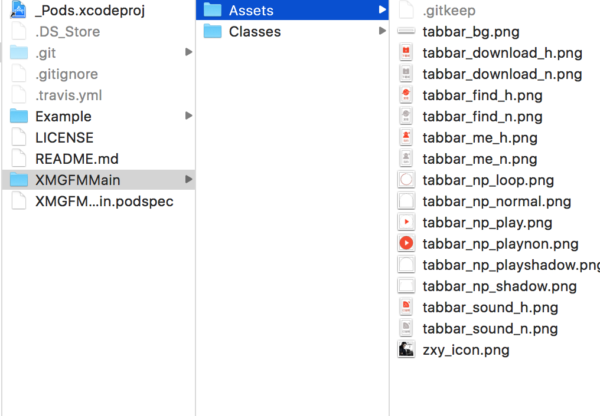

# 主骨架-组件化(实践)

## 本地库方案

### 组件划分

因为主骨架依赖 一些分类, 而这些分类在其他组件中也会使用, 所以此处采用"依赖下沉"的方式, 单独剥离出一个基础组件

### 抽离基础库-分类

* 把分类专门放在一个本地, 准备制作私有库的文件夹中
* `pod spec create XXX` 创建仓库描述文件
* 填写相关参数
	* 主要注意s.source_files的填写
	
	

### 测试

使用指明path的形式添加框架依赖




### 注意

* 如果是本地的私有库, 不需要使用 `pod lib lint` 或者 `pod spec lint` 验证spec文件的正确性
* 因为有些字段值,需要远程私有库才具备
* 但是可以放心使用, 只要保证路径正确
	
## 本地私有库方案优化

### 以上方式存在的问题

* 需要手动创建 podspec 文件
* 没有使用 git 管理
* 无法测试, 需要再次手动创建测试工程

### 解决方案

* 使用 pod lib 命令创建pod库模板工程
* 步骤
	* pod lib create XXX
	
	
		
	* 拖入代码到 Classes文件夹, 并删除ReplaceMe.m
	
	
	
	* 在宿主工程中, 直接测试, 没有问题后, 直接由外界以本地库的形式使用
		
## 远程私有库方案

### 以上方式存在的问题

* 需要主动指明路径
* 版本升级不好维护
* 多人合作开发??

### 解决方案

#### 使用远程私有库的方案

* 远程, 是为了队员下载
* 私有, 是为了只有团队内部人员可以下载
	
#### 步骤

1. 私有 Spec Repo 创建
	* 步骤图解
	
	
	
	
	
	
		
	* 问题
		* 如果报错, 没有权限
		* 需要设置SSH Key
			
			```
			ssh-keygen -t rsa -C "wangshunzi@520it.com"
			```
2. 创建Pod的所需要的项目工程文件，并上传到远程私有仓库
	1. `pod lib create XXXLib`
		* 创建仓库工程模板
	2. 添加需要的库文件到相应文件夹
	3. 测试无误后, 提交代码到远程私有仓库
		* 关联远程库
			
			```bash
			git remote add origin 远程仓库地址
			```
			
		* 提交到远程仓库
			
			```bash
			git push origin master
			```
			
	5. 打标签, 并提交到远程仓库
		
		```bash
		git tag -m "初始版本" "0.1.0"
		git push --tags     #推送tag到远程仓库
		```
		
3. 验证 podspec 文件

	```
	pod lib lint
	```
	
4. 向私有的 Spec Repo 中提交 podspec

	```
	pod repo push SpecName XXX.podspec
	```
	
	* 注意: 提交过程会有验证
		* 警告可以使用`--allow-warings` 忽略
		* 但是错误, 一定要解决
	* 注意: 过程会触发, 提交信息到远程私有索引库
5. 使用 pod 库
	1. 检索
	
		```
		pod search XXXLib
		```
		
		* 如果检索不到, 可以先到私有索引库内, 看看是否存在私有库
		* 如果存在还是检索不到, 则直接删除, 私有库索引文件
			 * `~/Library/Caches/CocoaPods/`
	2. 使用

		```
		source 'git@git.coding.net:wangshunzi/XMGFMSpecs.git'
		source 'https://github.com/CocoaPods/Specs.git'  #官方仓库的地址
		pod 'XXXLib/XXXSub'
		```
						
## 远程私有库的升级维护

### 如果以后扩充一些类, 如何操作?

* 扩充基础配置
* 扩充工具类
	
### 重新升级提交到远程仓库

* 代码升级

	```bash
	git add .
	git commit -m '注释'
	git push origin master
	```

* 版本升级

	```bash
	git tag -a '新版本号' -m '注释'
	git push --tags
	```
	
### 再次推送给本地私有库

pod repo push SpecName XXX.podspec
	
### 其他地方使用

```bash
pod update --no-repo-update
```
	
## 远程私有库依赖问题

扩充网络工具类

* 存在问题
	* 1. 工具类文件依赖分类, 依赖AFN, 依赖SDWebImage
* 解决方案:
	* 添加组件依赖
	
	```
	network.dependency 'AFNetworking'
	```
	
* 注意依赖, 以及框架头文件中, 不要直接导入依赖框架的头文件
	
## 远程私有库设计优化

### 上述版本存在的问题
	
假如另外一个业务线, 仅仅需要依赖一些基础配置, 但是, 如果把整个库作为依赖, 不太适合

### 解决方案

* 使用subspec

	

* subspec语法

	```ruby
	s.subspec 'XXXSub' do |sb|
		sb.source_files = '相对路径/**/*'
		sb.public_header_files = '相对路径/**/*.h'
		sb.resource = "相对路径/**/*.{bundle,nib,xib}"
		sb.dependency '', '~> 1.0.0'
	end
	```

### 外界使用


	
## 主框架的组件化

分为以下步骤


### 1. 剥离宿主工程代码到组件中

### 2. 解决依赖

把宿主工程的 podfile 文件中的依赖关系, 转移到组件的 podspec 文件中
	
### 3. 转移测试代码

### 4. 测试驱动调试

#### xib 加载问题

* 所有的代码中需要填写 `bundle` 的地方, 全部需要动态获取
	* 不能使用`[NSBundle mainBundle]`
	* 或者 nil
* `[NSBundle bundleForClass:self]`

#### 图片资源存放问题

* 所有的图片资源存放在
	* Assets
	
		
	
* 修改podspec文件
	
		

* 执行pod install 重新加载图片

#### 图片资源使用问题

* 在xib文件中
	* 在图片名称前面添加组件主bundle
* 代码加载图片
		
	```objc
	NSBundle *currentBundle = [NSBundle bundleForClass:[self class]];
	NSString *bundleName = [currentBundle.infoDictionary[@"CFBundleName"] stringByAppendingString:@".bundle"];
	NSString *path = [currentBundle pathForResource:@"tabbar_np_play@2x.png" ofType:nil inDirectory:bundleName];
	UIImage *image = [UIImage imageWithContentsOfFile:path];
	```

	* 一定注意, 不能直接使用 `imageNamed` 方法
	* 正确代码
		1. 获取当前的 `bundleName`
		2. 根据图片名称, 在 `bundle` 中检索图片路径
		3. 通过 `imageWithContentOfFile` 获取图片

			
### 5. 上传到远程私有仓库

1. 创建远程私有库
2. 给本地pod库添加远程关联
3. 上传到远程私有库
4. 打标签备份, 继续上传到私有库

### 6. 提交到本地的私有索引库

* 注意, 不要进行本地spec验证
	* 因为是私有库, 验证时, 找不到依赖
* 直接提交本地私有索引库
	* 进行提交验证通过就可以
* 使用测试
	* 删除宿主功能关于骨架的代码
			
## 统一披露API

### 主骨架组件的使用问题

组件内部提供服务很多, 但是如果他人使用, 无法确定有哪些API, 如何调用等

### 解决方案

* 统一披露API
* 参考原则
	* 需要提供哪些服务给外界
		* 直接以普通方法的形式让外界调用即可
	* 外界需要给你提供哪些服务
		* 让外界以block的形式, 或者通知的形式传递数据到组件内部, 内部做相应处理
		
### 披露API

1. 获取主骨架的主控制器
2. 添加子控制器
3. 设置中间按钮点击的响应事件
4. 设置全局的导航栏背景图片
5. 设置全局导航栏标题颜色, 和文字大小